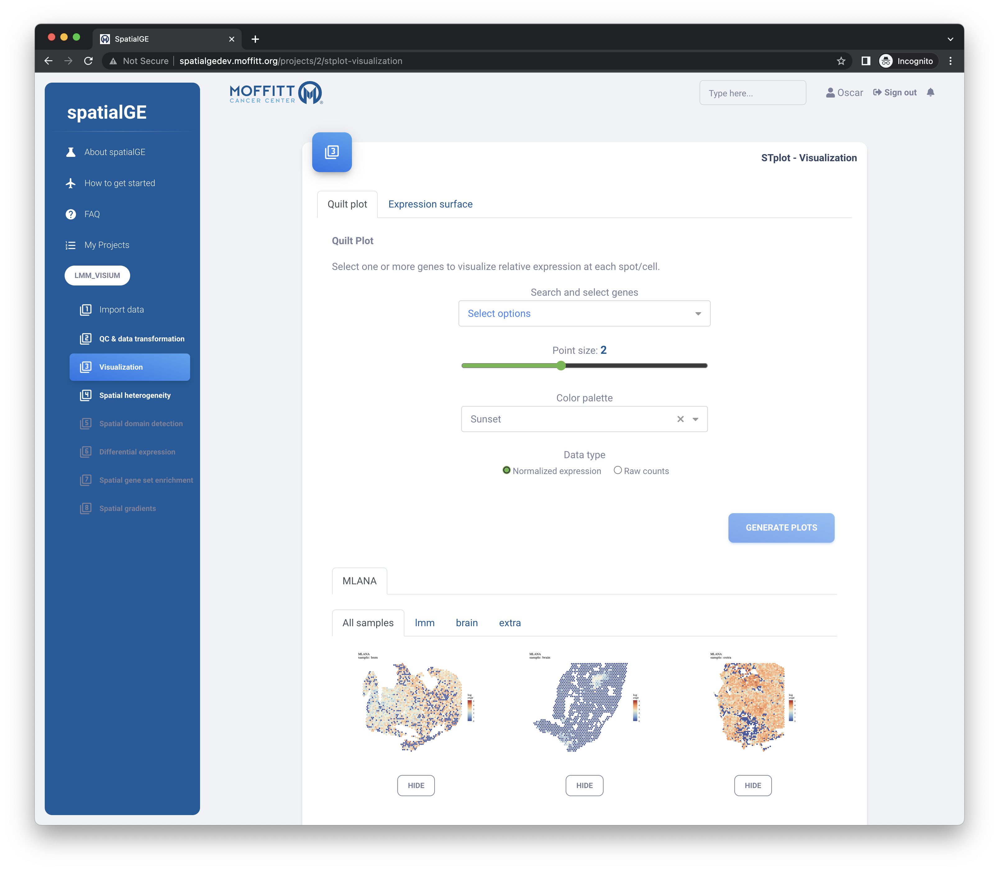

# spatialGE (web application)
This repository contains code for the web application designed as user-friendly, point-and-click interface to the spatialGE R package. The we application also implements other spatial transcriptomics analysis methods not included in the R package.

## about spatialGE

Laravel 10, VueJS 3, Bootstrap 5, Docker...

- NodeJS v18.14.0
- Laravel 10
- VueJS 3
- Bootstrap 5
- Docker (r-base with spatialGE and redis)

## Development environment

- composer update
- npm install
- Rename .env.example to .env in the root directory of the project 
- Create the DB in MySQL according to the name in .env 
- php artisan migrate --seed       (change migrate for migrate:fresh to delete all database tables and create them again)
- php artisan storage:link
- Follow the instructions in the readme file inside the _docker folder
- npm run dev  (this will run vite to compile any change in real-time)

## Server deployment

- Follow the instructions for the development environment, except for the last step, change it for:
- npm run build
